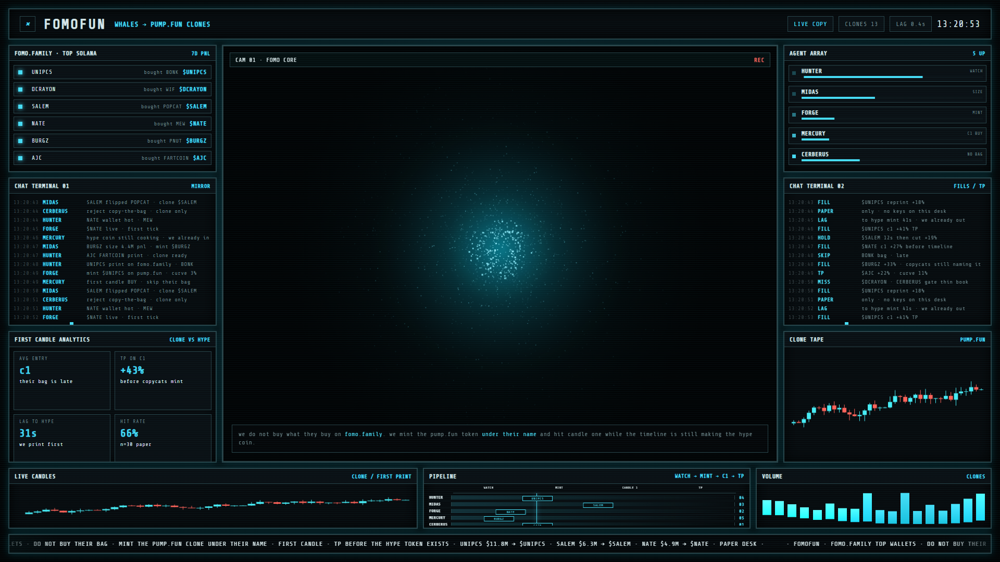

<p align="center">
  <strong>FOMOFUN</strong><br>
  copy FOMO.FAMILY whales onto pump.fun clones · first candle
</p>

<p align="center">
  <a href="https://fomo.family">fomo.family</a>
  ·
  <a href="https://pump.fun">pump.fun</a>
  ·
  Solana
</p>



[desk loop](docs/desk.mp4)

## What it is

Top traders on [fomo.family](https://fomo.family) print a bag. The timeline mints the hype token after.

FOMOFUN does not buy their bag. It mints a **pump.fun** token **under their name** (`$UNIPCS`, `$SALEM`, `$NATE`…) and takes **candle one** while copycats are still naming the hype coin.

Paper desk. No keys in this repo.

## Desk

Open `index.html` in a browser.

- CAM 01: FOMO core (hue-locked particle nebula)
- left: FOMO.FAMILY top Solana + mirror log + first-candle analytics
- right: agents + fills + clone tape
- bottom: candles · WATCH → MINT → C1 → TP · volume
- core color and terminal chrome share one hue loop

## Layout

```
index.html      1920×1080 room
src/style.css   chrome + hue tokens
src/desk.js     whales, logs, core, candles
docs/desk.png   still
docs/desk.mp4   4s loop
LICENSE         MIT
```

## Disclaimer

Not financial advice. Paper copy only. FOMOFUN never holds keys.
